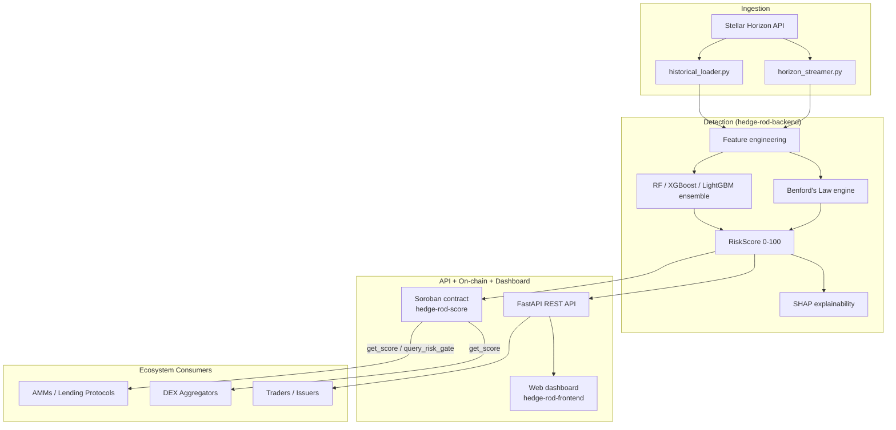

# HEDGE-ROD 🔍

**Wash-trading and artificial-volume detection for the Stellar DEX.**

[](https://github.com/HEDGE-ROD/hedge-rod-backend/actions)
[](https://github.com/HEDGE-ROD/hedge-rod-contract/actions)
[](https://stellar.org)
[](https://soroban.stellar.org)
[](https://github.com/HEDGE-ROD/hedge-rod-backend/blob/main/LICENSE)
[](#)

> Submitted to the Stellar **Drip Wave** builder programme.

Wash trading — simultaneously buying and selling the same asset to
artificially inflate volume — is one of the most pervasive forms of market
manipulation in DeFi. Stellar's ledger is fully transparent, but the sheer
volume of on-chain activity makes manual detection impossible, and no
production-grade, open-source detection system existed for the Stellar DEX.
**HEDGE-ROD fills that gap.**

It ingests trade data from the Stellar Horizon API, scores wallets and asset
pairs for wash-trading risk by combining **Benford's Law** digit-distribution
analysis with an **ensemble ML classifier** (Random Forest + XGBoost +
LightGBM, explained with SHAP), and publishes the resulting **HEDGE-ROD Risk
Score (0–100)** through a public REST API, a web dashboard, and an on-chain
Soroban risk registry that other Stellar protocols can query directly.

## Why this matters

- **Traders are misled** by volume that looks like real liquidity and isn't.
- **Token issuers manipulate rankings** on DEX aggregators by inflating
  24h volume.
- **Liquidity providers lose funds** entering pools dominated by self-dealing.
- **Ecosystem credibility suffers** — inflated metrics undermine confidence
  from institutions, exchanges, and new users.

HEDGE-ROD is fully open — the scores, features, and methodology are
transparent and auditable, and the on-chain registry means any AMM, lending
protocol, or aggregator on Stellar can gate against a risk score natively,
without trusting an external oracle.

## Organization map

HEDGE-ROD is split across **three** repos plus this org-profile repo:

| Repo | Role | Language |
|---|---|---|
| [**hedge-rod-backend**](https://github.com/HEDGE-ROD/hedge-rod-backend) | Detection engine + public REST API: Horizon ingestion, Benford's Law analysis, ML feature engineering, ensemble training/inference, SHAP explanations, the `RiskScore` schema, and on-chain publishing | Python (FastAPI) |
| [**hedge-rod-contract**](https://github.com/HEDGE-ROD/hedge-rod-contract) | Soroban smart contract — the on-chain risk registry (`hedge-rod-score`). Exposes `submit_score` / `get_score` / `query_risk_gate` for composability with other Stellar protocols | Rust (Soroban) |
| [**hedge-rod-frontend**](https://github.com/HEDGE-ROD/hedge-rod-frontend) | Dependency-free web dashboard: score lookup, recent alerts, asset risk ranking, SHAP explanations | HTML / CSS / JS (vanilla) |
| **.github** *(this repo)* | Org profile, shared CI workflows, issue/PR templates, contributing & governance docs, cross-repo schema-sync check | — |

### Architecture



**Data flow:** `hedge-rod-backend` pulls trades from Horizon, computes
Benford + ML features, produces a `RiskScore` record, serves it over REST,
and pushes scores above threshold on-chain via `submit_score`.
`hedge-rod-frontend` reads the REST API to render scores, alerts, and SHAP
explanations. `hedge-rod-contract` persists the score in the on-chain
registry so any other Soroban contract can call `get_score` /
`query_risk_gate` without an external oracle.

## The shared data contract

`RiskScore` is the one schema every repo agrees on:

```
wallet: str            score: int (0-100)       benford_flag: bool
asset_pair: str         confidence: int (0-100)  ml_flag: bool
timestamp: datetime / u64
```

It is defined in Python (`hedge-rod-backend/detection/risk_score.py`, reused
directly by the FastAPI response models) and mirrored in Rust
(`hedge-rod-contract/contracts/hedge-rod-score/src/types.rs`). Because it's
defined twice, in two languages, **schema drift is the most common
cross-repo bug** — see [`scripts/check_schema_sync.py`](../scripts/check_schema_sync.py)
in this repo, which CI runs to catch drift automatically.

## Start here

| I want to... | Go to |
|---|---|
| Run the detection engine / API locally | [hedge-rod-backend README](https://github.com/HEDGE-ROD/hedge-rod-backend#readme) |
| Deploy or call the Soroban risk registry | [hedge-rod-contract README](https://github.com/HEDGE-ROD/hedge-rod-contract#readme) |
| Run the dashboard | [hedge-rod-frontend README](https://github.com/HEDGE-ROD/hedge-rod-frontend#readme) |
| Contribute (Rust / Python / ML / frontend) | [CONTRIBUTING.md](../CONTRIBUTING.md) |
| Report a bug or request a feature | [Issue templates](../ISSUE_TEMPLATE) |
| Report a security issue | [SECURITY.md](../SECURITY.md) |

Quick local loop across all three repos:

```bash
# 1. backend: detection engine + API
git clone https://github.com/HEDGE-ROD/hedge-rod-backend && cd hedge-rod-backend
pip install -r requirements.txt && cp .env.example .env
python cli.py generate-data && python cli.py train
uvicorn api.main:app --reload   # http://localhost:8000

# 2. frontend: dashboard (in a second terminal)
git clone https://github.com/HEDGE-ROD/hedge-rod-frontend && cd hedge-rod-frontend
./serve.sh                      # http://localhost:5173

# 3. contract: Soroban risk registry (optional, needs the Rust toolchain)
git clone https://github.com/HEDGE-ROD/hedge-rod-contract && cd hedge-rod-contract
cargo test --workspace
```

## Contributing

We're actively looking for Rust, Python, ML, and frontend contributors. See
[CONTRIBUTING.md](../CONTRIBUTING.md) for per-repo dev setup, commit
conventions, and test/coverage expectations, and look for issues labeled
[`good first issue`](https://github.com/search?q=org%3AHEDGE-ROD+label%3A%22good+first+issue%22+is%3Aopen&type=issues)
across the org. Cross-repo CI is shared from this repo — see
[`.github/workflows/`](../.github/workflows) for the reusable jobs each repo calls.

## References

- Benford, F. (1938) 'The law of anomalous numbers', *Proceedings of the American Philosophical Society*, 78(4), pp. 551–572.
- Stellar Development Foundation, [Horizon API docs](https://developers.stellar.org/api/horizon)
- Stellar Development Foundation, [Soroban docs](https://soroban.stellar.org/docs)

---

<div align="center">

**HEDGE-ROD** — Making the Stellar ledger legible.

*Built for the Stellar ecosystem. Open source. Community owned.*

</div>
